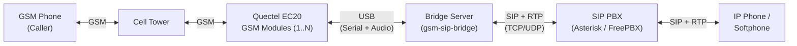
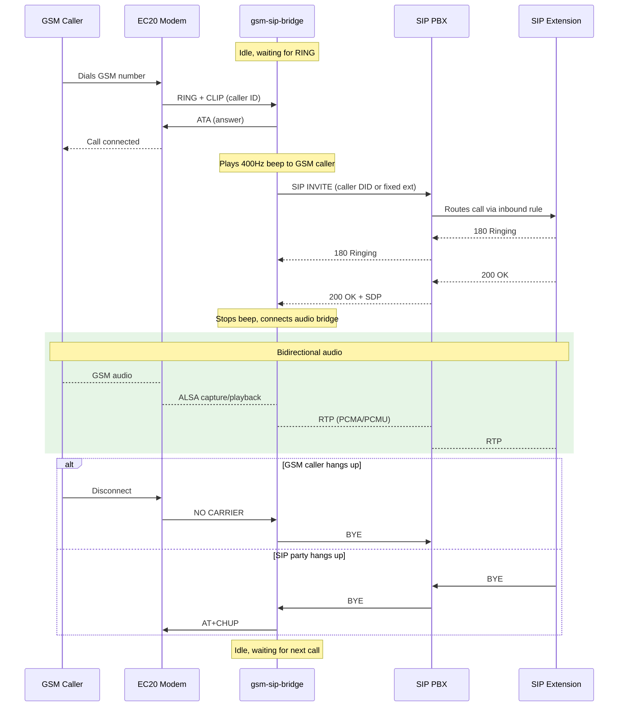
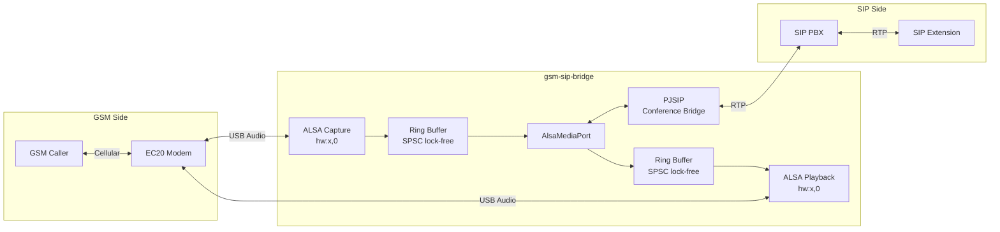

# GSM-SIP Bridge

Bridge incoming GSM calls to a SIP extension over VoIP. When someone dials the GSM number on a Quectel EC20 module, the system auto-answers, dials a configurable SIP extension, and routes audio bidirectionally between the two parties. Supports multiple EC20 modules simultaneously.

**Version**: 3.0.0 | **Language**: C++17 | **Platform**: Linux

## Prerequisites

- Linux (Debian/Ubuntu recommended)
- GCC 9+ with C++17 support
- CMake 3.14+
- ALSA development headers (`libasound2-dev`)
- PJSIP development libraries (`libpjproject-dev` or built from source)
- One or more Quectel EC20 modules connected via USB, each with an active SIM card
- SIP server account (Asterisk, FreePBX, MikoPBX, etc.)

Install build dependencies:

```bash
sudo apt install build-essential cmake g++ libasound2-dev libpjproject-dev
```

## Quick Start

```bash
git clone <repo-url> && cd audio-echo
cp config.ini.example config.ini    # edit with your SIP credentials
make build
make test
make run
```

## Multi-Card Support

The system automatically detects all connected EC20 modules at startup by scanning the USB bus for devices matching vendor/product ID `2c7c:0125`. Each detected module:

- Receives a **stable card identifier** derived from its USB hardware serial number (e.g., `ec20-A1B2C3`). The same physical module always gets the same ID regardless of USB enumeration order.
- Runs its own independent call-handling thread with isolated serial port and ALSA audio.
- Can handle one GSM call at a time, bridged to SIP concurrently with calls on other modules.

All modules share a single SIP server registration and configuration. No per-module config is needed.

### Startup Behavior

- If **no modules** are found, the system exits with an error.
- If **some modules** fail initialization (e.g., SIM not registered), the system logs warnings and operates with the remaining functional modules.
- **Failed modules are retried** every 30 seconds in the background. When a previously failed module becomes functional, it joins the active pool automatically.
- At least **one functional module** is required to start.

### Example Startup Output

```text
2026-05-02T10:00:00.100 INFO detected 3 EC20 module(s)
2026-05-02T10:00:00.200 INFO [ec20-A1B2C3] initializing (serial=/dev/ttyUSB2, audio=hw:1,0)
2026-05-02T10:00:00.500 INFO [ec20-A1B2C3] GSM network registration confirmed
2026-05-02T10:00:00.600 INFO [ec20-D4E5F6] initializing (serial=/dev/ttyUSB6, audio=hw:2,0)
2026-05-02T10:00:01.000 INFO [ec20-D4E5F6] GSM network registration confirmed
2026-05-02T10:00:01.100 INFO [ec20-G7H8I9] initializing (serial=/dev/ttyUSB10, audio=hw:3,0)
2026-05-02T10:00:01.500 ERROR [ec20-G7H8I9] SIM not registered on network
2026-05-02T10:00:02.000 INFO === Module Summary ===
2026-05-02T10:00:02.001 INFO   [ec20-A1B2C3] serial=/dev/ttyUSB2 audio=hw:1,0 — ACTIVE
2026-05-02T10:00:02.002 INFO   [ec20-D4E5F6] serial=/dev/ttyUSB6 audio=hw:2,0 — ACTIVE
2026-05-02T10:00:02.003 INFO   [ec20-G7H8I9] serial=/dev/ttyUSB10 audio=hw:3,0 — FAILED (SIM not registered on network)
2026-05-02T10:00:02.004 INFO ready, 2 module(s) active, 1 failed
2026-05-02T10:00:02.005 INFO retry thread started (30s interval)
```

### Single-Card Override

When both `--serial` and `--audio` flags are provided, the system operates in single-card mode with the specified devices, bypassing auto-detection:

```bash
gsm-sip-bridge -s /dev/ttyUSB3 -a hw:2,0 --config config.ini
```

## One-Time EC20 Setup

Enable USB Audio Class (UAC) on each EC20 module:

```bash
# Connect to AT command port
minicom -D /dev/ttyUSB2 -b 115200

# Enable UAC (last parameter = 1)
AT+QCFG="USBCFG",0x2C7C,0x0125,1,1,1,1,1,0,1

# Reboot module
AT+CFUN=1,1
```

Verify audio device appears:

```bash
arecord -l    # Should show a card named "Android"
aplay -l      # Same card for playback
```

Repeat for each EC20 module.

## Configuration

Create a `config.ini` file (see `config.ini.example`):

```ini
[sip]
server = pbx.example.com
port = 5060
username = bridge-account
password = your-password
transport = udp
local_port = 5060

[bridge]
; sip_destination = 599
sip_dial_timeout_sec = 30
```

| Section | Field | Default | Description |
|---------|-------|---------|-------------|
| `[sip]` | `server` | *(required)* | SIP server hostname or IP |
| `[sip]` | `port` | `5060` | SIP server port |
| `[sip]` | `username` | *(required)* | SIP account username |
| `[sip]` | `password` | *(required)* | SIP account password |
| `[sip]` | `transport` | `udp` | Transport protocol: `udp`, `tcp`, or `tls` |
| `[sip]` | `local_port` | `5060` | Local SIP port (fixed to avoid stale registrations) |
| `[sip]` | `display_name` | username | Display name shown to callees |
| `[bridge]` | `sip_destination` | *(empty)* | SIP extension to dial. When empty, the GSM caller's number is used as the DID, letting the PBX inbound route decide the destination. |
| `[bridge]` | `sip_dial_timeout_sec` | `30` | Seconds to wait for SIP answer (5-120) |

The `[bridge]` section is optional; defaults apply if absent. All modules share the same configuration.

## Observability

The bridge exposes Prometheus-compatible metrics on an HTTP endpoint for monitoring call activity, SIP registration, module health, and errors in real time.

### Metrics Endpoint

The bridge serves metrics at `http://<host>:9091/metrics` (Prometheus exposition format). Configure the port via the `METRICS_PORT` environment variable.

| Environment Variable | Default | Description |
|---|---|---|
| `METRICS_PORT` | `9091` | Port for the metrics HTTP server |

### Available Metrics

| Metric | Type | Description |
|---|---|---|
| `gsm_bridge_calls_total` | Counter | GSM calls by module, status (incoming/answered/missed), and caller ID |
| `gsm_bridge_sip_calls_total` | Counter | Outbound SIP calls by module and status (initiated/connected/timeout/error) |
| `gsm_bridge_sip_registrations_total` | Counter | SIP registration attempts by status |
| `gsm_bridge_module_init_total` | Counter | Module initialization attempts by status |
| `gsm_bridge_module_retries_total` | Counter | Module retry attempts |
| `gsm_bridge_audio_errors_total` | Counter | Audio errors by module and type |
| `gsm_bridge_sip_registered` | Gauge | SIP registration state (1=registered, 0=unregistered) |
| `gsm_bridge_modules_active` | Gauge | Number of active modules |
| `gsm_bridge_modules_failed` | Gauge | Number of failed modules pending retry |
| `gsm_bridge_active_calls` | Gauge | Currently active bridged calls per module |
| `gsm_bridge_uptime_seconds` | Gauge | Process uptime |
| `gsm_bridge_call_duration_seconds` | Histogram | Call duration distribution (buckets: 1s to 30min) |

### Monitoring Stack (Docker Compose)

The Docker Compose setup includes Prometheus and Grafana with a pre-configured dashboard:

```bash
docker compose up -d --build
```

| Service | URL | Purpose |
|---|---|---|
| gsm-sip-bridge | `http://localhost:9091/metrics` | Metrics endpoint |
| Prometheus | `http://localhost:9090` | Metrics collection and querying |
| Grafana | `http://localhost:3000` | Dashboards and visualization |

Grafana credentials: `admin` / `admin`. The "GSM-SIP Bridge" dashboard is auto-provisioned on first boot.


Dashboard panels include:

- System overview (SIP registration, active modules, uptime, call counts)
- GSM and SIP call rates over time
- Active calls per module
- Call duration percentiles (p50/p95/p99)
- SIP registration state timeline
- Module health and retry counts
- Audio and SIP error rates

### Verify Metrics

```bash
curl http://localhost:9091/metrics
```

## Usage

```bash
gsm-sip-bridge --config config.ini              # auto-detect all EC20 modules
gsm-sip-bridge --config config.ini --verbose    # verbose SIP + AT logging
gsm-sip-bridge -s /dev/ttyUSB3 -a hw:2,0       # single-card override
```

### System Overview



### Call Flow



### Audio Pipeline



Each EC20 module has its own isolated audio pipeline. Multiple pipelines run concurrently when multiple modules are active.

If the SIP call fails (busy, timeout, unreachable), the GSM caller hears an error tone and the call is terminated.

## Makefile Targets

| Target            | Description                              |
|-------------------|------------------------------------------|
| `make build`      | Compile all binaries                     |
| `make test`       | Run the full integration test suite      |
| `make run`        | Build and run the GSM-SIP bridge         |
| `make clean`      | Remove all build artifacts               |
| `make lint`       | Run static analysis                      |
| `make help`       | Show all available targets               |

### Debug Utilities

Two standalone echo tools are included for isolating GSM or SIP issues independently:

| Target            | Description                              |
|-------------------|------------------------------------------|
| `make run-gsm-echo` | Echo GSM audio back to caller (no SIP) |
| `make run-sip-echo` | Echo SIP audio back to caller (no GSM) |

## ModemManager Interference

ModemManager probes `ttyUSB*` ports for modems, which corrupts AT sessions. The program warns at startup if ModemManager is active. To fix permanently, install the included udev rule:

```bash
sudo cp etc/99-ec20-audio-echo.rules /etc/udev/rules.d/
sudo udevadm control --reload-rules && sudo udevadm trigger
```

To stop it immediately:

```bash
sudo systemctl stop ModemManager
sudo systemctl disable ModemManager
```

## Troubleshooting

**No `/dev/ttyUSB*` devices**: Check `dmesg | grep ttyUSB`. Ensure `option` and `qcserial` kernel modules are loaded.

**No audio device in `arecord -l`**: UAC not enabled. Follow the one-time setup above for each module.

**SIP registration failed**: Verify credentials in `config.ini`. Check PBX logs. Ensure the SIP port is correct.

**SIP call fails / busy**: Verify `sip_destination` is a valid, reachable extension on the PBX.

**No audio after SIP answers**: Check that `AT+QPCMV=1,2` succeeded in the logs. This routes voice audio to USB.

**Module shows FAILED at startup**: Check the failure reason in the startup summary. Common causes: SIM not inserted, SIM not registered on network, serial port claimed by another process.

**Retry thread not recovering module**: Verify the underlying issue is resolved (SIM registered, USB audio available). The retry thread attempts reinitialization every 30 seconds.

**Permission denied**: Add user to `dialout` and `audio` groups:

```bash
sudo usermod -aG dialout,audio $USER
```

**Audio clicks/dropouts**: Ensure no other process claims the ALSA device (`fuser /dev/snd/*`).
