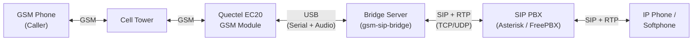
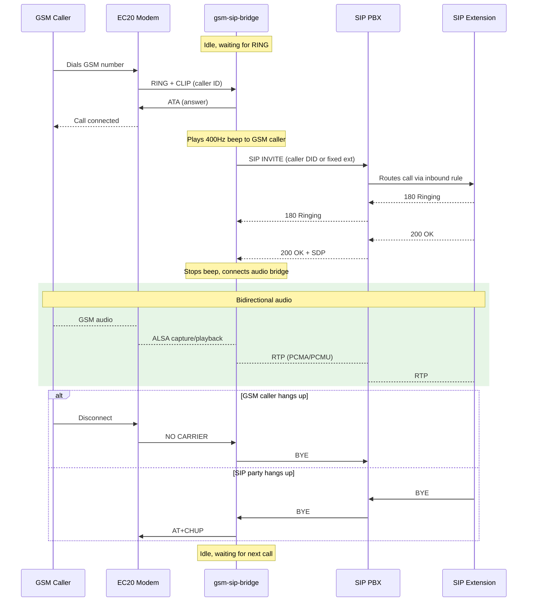
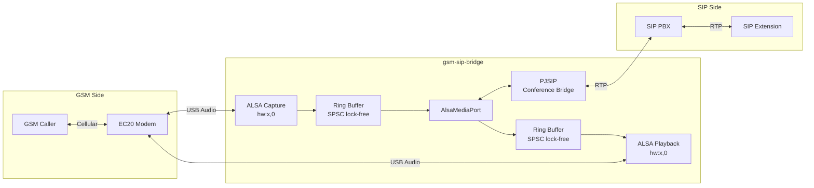

# GSM-SIP Bridge

Bridge incoming GSM calls to a SIP extension over VoIP. When someone dials the GSM number on the Quectel EC20 module, the system auto-answers, dials a configurable SIP extension, and routes audio bidirectionally between the two parties.

**Version**: 1.1.0 | **Language**: C++17 | **Platform**: Linux

## Prerequisites

- Linux (Debian/Ubuntu recommended)
- GCC 9+ with C++17 support
- CMake 3.14+
- ALSA development headers (`libasound2-dev`)
- PJSIP development libraries (`libpjproject-dev` or built from source)
- Quectel EC20 module connected via USB with an active SIM card
- SIP server account (Asterisk, FreePBX, MikoPBX, etc.)

Install build dependencies:

```bash
sudo apt install build-essential cmake g++ libasound2-dev libpjproject-dev
```

## Quick Start

```bash
git clone <repo-url> && cd audio-echo
cp config.ini.example config.ini    # edit with your SIP credentials
make build
make test
make run
```

## One-Time EC20 Setup

Enable USB Audio Class (UAC) on the EC20 module:

```bash
# Connect to AT command port
minicom -D /dev/ttyUSB2 -b 115200

# Enable UAC (last parameter = 1)
AT+QCFG="USBCFG",0x2C7C,0x0125,1,1,1,1,1,0,1

# Reboot module
AT+CFUN=1,1
```

Verify audio device appears:

```bash
arecord -l    # Should show a card named "Android"
aplay -l      # Same card for playback
```

## Configuration

Create a `config.ini` file (see `config.ini.example`):

```ini
[sip]
server = pbx.example.com
port = 5060
username = bridge-account
password = your-password
transport = udp
local_port = 5060

[bridge]
; sip_destination = 599
sip_dial_timeout_sec = 30
```

| Section | Field | Default | Description |
|---------|-------|---------|-------------|
| `[sip]` | `server` | *(required)* | SIP server hostname or IP |
| `[sip]` | `port` | `5060` | SIP server port |
| `[sip]` | `username` | *(required)* | SIP account username |
| `[sip]` | `password` | *(required)* | SIP account password |
| `[sip]` | `transport` | `udp` | Transport protocol: `udp`, `tcp`, or `tls` |
| `[sip]` | `local_port` | `5060` | Local SIP port (fixed to avoid stale registrations) |
| `[sip]` | `display_name` | username | Display name shown to callees |
| `[bridge]` | `sip_destination` | *(empty)* | SIP extension to dial. When empty, the GSM caller's number is used as the DID, letting the PBX inbound route decide the destination. |
| `[bridge]` | `sip_dial_timeout_sec` | `30` | Seconds to wait for SIP answer (5-120) |

The `[bridge]` section is optional; defaults apply if absent.

## Usage

```bash
gsm-sip-bridge --config config.ini              # auto-detect EC20, bridge to configured extension
gsm-sip-bridge --config config.ini --verbose    # verbose SIP + AT logging
gsm-sip-bridge -s /dev/ttyUSB3 -a hw:2,0       # override GSM devices
```

### System Overview



### Call Flow



### Audio Pipeline



If the SIP call fails (busy, timeout, unreachable), the GSM caller hears an error tone and the call is terminated.

## Makefile Targets

| Target            | Description                              |
|-------------------|------------------------------------------|
| `make build`      | Compile all binaries                     |
| `make test`       | Run the full integration test suite      |
| `make run`        | Build and run the GSM-SIP bridge         |
| `make clean`      | Remove all build artifacts               |
| `make lint`       | Run static analysis                      |
| `make help`       | Show all available targets               |

### Debug Utilities

Two standalone echo tools are included for isolating GSM or SIP issues independently:

| Target            | Description                              |
|-------------------|------------------------------------------|
| `make run-gsm-echo` | Echo GSM audio back to caller (no SIP) |
| `make run-sip-echo` | Echo SIP audio back to caller (no GSM) |

## Architecture

```text
src/
├── logger.h              # Shared timestamped stdout logging
├── ring_buffer.h         # Lock-free SPSC ring buffer (header-only)
├── device_discovery.*    # USB sysfs auto-detection (VID:PID 2c7c:0125)
├── serial_port.*         # POSIX termios RAII wrapper
├── at_commander.*        # AT command send/receive, URC parsing
├── audio_loop.*          # ALSA capture->playback loopback (used by GSM echo)
├── main.cpp              # GSM echo entry point (debug utility)
├── sip/
│   ├── main.cpp          # SIP echo entry point (debug utility)
│   ├── sip_config.*      # INI config parser and validation
│   ├── echo_account.*    # pj::Account for SIP echo
│   └── echo_call.*       # pj::Call for SIP echo loopback
└── bridge/
    ├── main.cpp          # Bridge: GSM+SIP orchestration, state machine
    ├── bridge_config.*   # [bridge] section INI parser
    ├── bridge_account.*  # pj::Account for outbound SIP calls
    ├── bridge_call.*     # pj::Call for outbound SIP leg
    ├── alsa_media_port.* # AudioMediaPort adapter (ALSA <-> PJSIP)
    └── beep_generator.*  # 400Hz tone pattern generator

vendor/
└── mini/ini.h            # mINI header-only INI parser (MIT)

tests/integration/        # 70 integration tests
```

## ModemManager Interference

ModemManager probes `ttyUSB*` ports for modems, which corrupts AT sessions. The program warns at startup if ModemManager is active. To fix permanently, install the included udev rule:

```bash
sudo cp etc/99-ec20-audio-echo.rules /etc/udev/rules.d/
sudo udevadm control --reload-rules && sudo udevadm trigger
```

To stop it immediately:

```bash
sudo systemctl stop ModemManager
sudo systemctl disable ModemManager
```

## Troubleshooting

**No `/dev/ttyUSB*` devices**: Check `dmesg | grep ttyUSB`. Ensure `option` and `qcserial` kernel modules are loaded.

**No audio device in `arecord -l`**: UAC not enabled. Follow the one-time setup above.

**SIP registration failed**: Verify credentials in `config.ini`. Check PBX logs. Ensure the SIP port is correct.

**SIP call fails / busy**: Verify `sip_destination` is a valid, reachable extension on the PBX.

**No audio after SIP answers**: Check that `AT+QPCMV=1,2` succeeded in the logs. This routes voice audio to USB.

**Permission denied**: Add user to `dialout` and `audio` groups:

```bash
sudo usermod -aG dialout,audio $USER
```

**Audio clicks/dropouts**: Ensure no other process claims the ALSA device (`fuser /dev/snd/*`).
