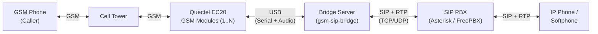
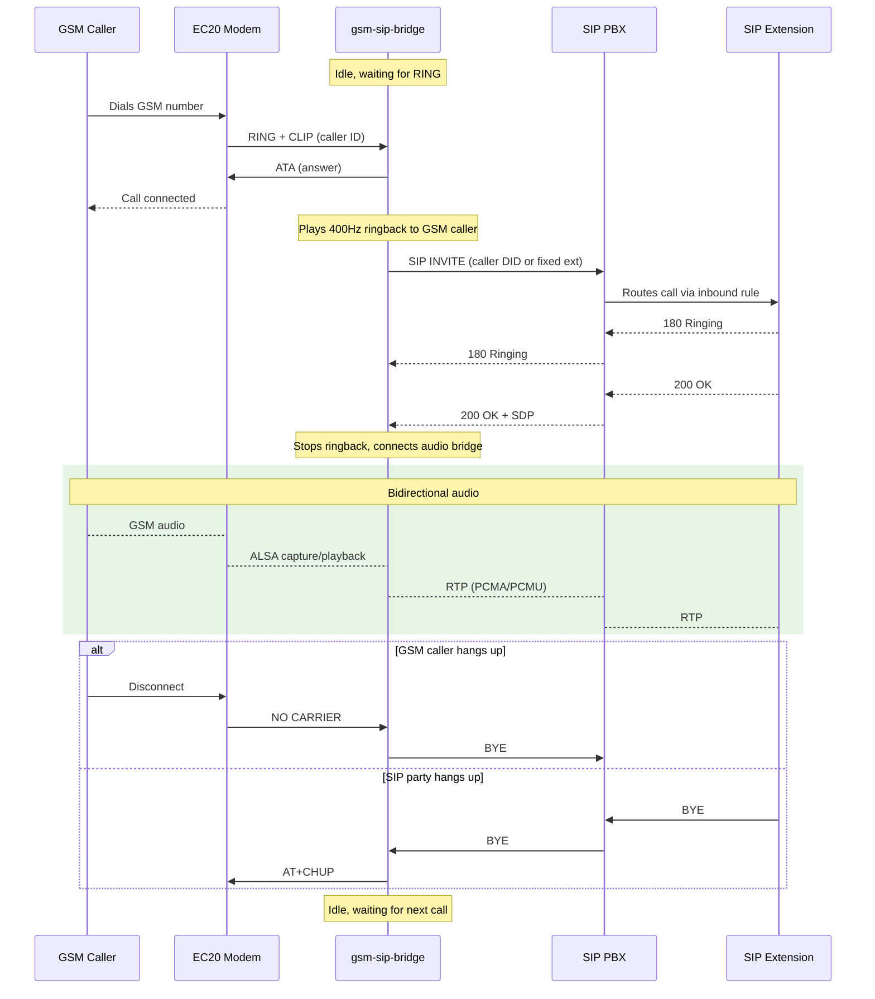
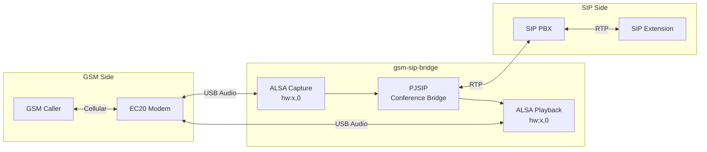
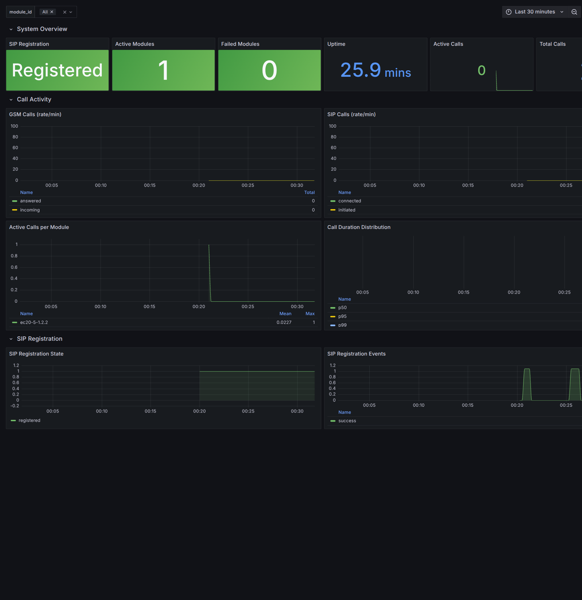

# GSM-SIP Bridge

Bridge incoming GSM calls on Quectel EC20 modules to a SIP extension over VoIP. When someone dials the GSM number, the system auto-answers, dials a configurable SIP extension, and routes audio bidirectionally between the two parties. Supports multiple EC20 modules simultaneously. Incoming SMS messages are persisted to a local database and optionally forwarded to Discord.

**Version**: 5.1.0 | **Language**: Rust | **Platform**: Linux (amd64, arm64)

## Features

- **GSM-to-SIP Call Bridging** -- Auto-answers incoming GSM calls on Quectel EC20 modules and bridges audio bidirectionally to a SIP extension via a PBX.
- **Multi-Module Support** -- Detects all connected EC20 modules at startup, assigns stable hardware IDs, and handles concurrent calls across modules independently.
- **Automatic Card Recovery** -- Detects USB disconnects within 5 seconds and network registration loss within a configurable timeout. Uses exponential backoff (default: 5 s → 120 s) and gives up after a configurable retry limit. Each card recovers independently; other cards are unaffected.
- **IMEI-keyed Slot Persistence** -- A card's slot assignment is derived from its IMEI and stored in the database. The same physical card always gets the same slot number across restarts and re-plugs, even if the USB enumeration order changes.
- **Startup Diagnostics** -- Prints each card's phone number and current network type (`4G/LTE`, `3G/UMTS`, `2G/EDGE`, `No Signal`, `No SIM`) before the ready message, giving immediate visibility into provisioning state.
- **Persisted Network Mode Preferences** -- The `card set-mode` command stores a per-slot network preference (`2g`, `3g`, `4g`, `auto`) in the database. The preference is re-applied to the modem on every card initialization, including after automatic recovery.
- **CLI Card Management** -- `card list`, `card restart`, `card set-mode`, and `card get-mode` subcommands communicate with the running daemon over a Unix domain socket for on-demand slot management without restarting the bridge.
- **DID Passthrough** -- Forwards the GSM caller's number as the SIP DID via `P-Asserted-Identity` and `X-GSM-Caller-ID` headers, enabling PBX inbound routing rules to decide the destination.
- **SMS-to-Discord Forwarding** -- Captures incoming SMS from all modules, persists to a local SQLite database, and posts rich embed notifications to a Discord webhook.
- **Call Logging** -- Every incoming GSM call is recorded in a local SQLite database with caller ID, module, timestamp, duration, SIP destination, and outcome (answered/missed/failed).
- **SMS Persistence** -- All received SMS messages are stored in SQLite with sender, body, timestamp, and forwarding status, surviving restarts and Discord outages.
- **Prometheus Metrics** -- Exposes call counts, SIP registration state, module health, audio errors, SMS throughput, uptime, and call duration histograms on a `/metrics` endpoint.
- **Grafana Dashboard** -- Ships a pre-provisioned dashboard with panels for system overview, call rates, active calls, duration percentiles, module health, and SMS forwarding.
- **Docker Compose Stack** -- One-command deployment with the bridge, Prometheus, Grafana, and sqlite-web running in host network mode.
- **Comfort Ringback Tone** -- Plays a 400 Hz ringback tone to the GSM caller while the SIP extension is being dialed (via PJSIP tonegen).
- **USB Device Auto-Discovery** -- Scans the USB bus by vendor/product ID, matches serial numbers for stable identification, and maps AT command ports to ALSA audio devices.
- **Memory Safety** -- Zero `unsafe` in the application binary; all FFI confined to the `pjsua-sys` and `pjsua-safe` crates with documented safety invariants.

## Quick Start (Docker Compose)

The recommended deployment method. Requires Docker with Compose plugin and one or more Quectel EC20 USB modems.

```bash
git clone <repo-url> && cd gsm-sip-bridge/docker
cp ../config.toml.example config.toml   # edit with your SIP/PBX details
cat > .env <<EOF
SIP_PASSWORD=yourpassword
DISCORD_WEBHOOK_URL=https://discord.com/api/webhooks/...
EOF
docker compose up -d
```

This starts the full stack:

| Service | URL | Purpose |
|---|---|---|
| gsm-sip-bridge | `http://localhost:9091/metrics` | Bridge + metrics endpoint |
| Prometheus | `http://localhost:9090` | Metrics collection and querying |
| Grafana | `http://localhost:3000` | Dashboards (admin/admin) |
| sqlite-web | `http://localhost:8088` | Browse call and SMS database (read-only) |

The container runs in `privileged` + `network_mode: host` to access USB devices and ALSA audio.

### Update

```bash
docker compose pull && docker compose up -d
```

## Building from Source

For development or non-Docker deployments.

### Prerequisites

- Rust stable (pinned by `rust-toolchain.toml`)
- System packages: `build-essential`, `pkg-config`, `clang`, `libclang-dev`
- Libraries: `libasound2-dev`, `libusb-1.0-0-dev`, `libpjproject-dev` (>= 2.14), `uuid-dev`
- Hardware: One or more Quectel EC20 USB modems with active SIM cards
- SIP server account (Asterisk, FreePBX, MikoPBX, etc.)

Install build dependencies:

```bash
sudo apt install build-essential pkg-config clang libclang-dev \
  libasound2-dev libusb-1.0-0-dev libpjproject-dev uuid-dev libssl-dev
```

### Build and Run

```bash
cp config.toml.example config.toml   # edit with your SIP/PBX details
export SIP_PASSWORD=yourpassword
make build
make test
make run
```

## Architecture

Three-crate Cargo workspace:

| Crate | Role |
|---|---|
| `pjsua-sys` | Auto-generated FFI bindings to PJSIP's C `pjsua` API (via bindgen) |
| `pjsua-safe` | Safe Rust wrappers (all `unsafe` blocks carry `// SAFETY:` comments) |
| `gsm-sip-bridge` | The binary crate -- zero `unsafe` |

```text
┌──────────────────────────────────────────────┐
│                  main.rs                      │
├──────────────┬──────────┬────────────────────┤
│  CardPool    │ SipBridge│   SmsHandler       │
│  (modules/)  │ (sip/)   │   (sms/)           │
├──────────────┴──────────┴────────────────────┤
│  config  │  metrics  │  store  │  runtime    │
├──────────┴───────────┴─────────┴─────────────┤
│          pjsua-safe  ←  pjsua-sys            │
└──────────────────────────────────────────────┘
```

### System Overview



### Call Flow



### Audio Pipeline



Each EC20 module has its own isolated audio pipeline. Multiple pipelines run concurrently when multiple modules are active. Audio bridging is handled by PJSIP's conference bridge via `pjsua_conf_connect`.

## Multi-Card Support

The system automatically detects all connected EC20 modules at startup by scanning the USB bus for devices matching vendor/product ID `2c7c:0125`. Each detected module:

- Receives a **stable card identifier** derived from its USB hardware serial number (e.g., `ec20-A1B2C3`). The same physical module always gets the same ID regardless of USB enumeration order.
- Runs its own independent call-handling task with isolated serial port and ALSA audio.
- Can handle one GSM call at a time, bridged to SIP concurrently with calls on other modules.

All modules share a single SIP server registration and configuration.

### Startup Behavior

- If **no modules** are found, the system waits and retries (does not exit immediately).
- If **some modules** fail initialization (e.g., SIM not registered), the system logs warnings and operates with the remaining functional modules.
- **Failed modules are retried** every 30 seconds in the background. When a previously failed module becomes functional, it joins the active pool automatically.

### Single-Card Override

When both `--serial` and `--audio` flags are provided, the system operates in single-card mode with the specified devices, bypassing auto-detection:

```bash
gsm-sip-bridge -s /dev/ttyUSB3 -a hw:2,0 --config config.toml
```

## One-Time EC20 Setup

Enable USB Audio Class (UAC) on each EC20 module:

```bash
minicom -D /dev/ttyUSB2 -b 115200

# Enable UAC (last parameter = 1)
AT+QCFG="USBCFG",0x2C7C,0x0125,1,1,1,1,1,0,1

# Reboot module
AT+CFUN=1,1
```

Verify audio device appears:

```bash
arecord -l    # Should show a card named "Android"
aplay -l      # Same card for playback
```

Repeat for each EC20 module.

## Configuration

Create a `config.toml` file (see `config.toml.example`):

```toml
[sip]
server = "pbx.example.com"
port = 5060
username = "bridge-account"
password = "env:SIP_PASSWORD"
transport = "udp"
local_port = 5060
display_name = "GSM Bridge"

[bridge]
# sip_destination = "599"
sip_dial_timeout_sec = 30

[sms]
enabled = true
discord_webhook_url = "env:DISCORD_WEBHOOK_URL"
db_path = "/var/lib/gsm-sip-bridge/bridge.db"

[metrics]
port = 9091

[modules]
max_concurrent = 8
```

| Section | Field | Default | Description |
|---------|-------|---------|-------------|
| `[sip]` | `server` | *(required)* | SIP server hostname or IP |
| `[sip]` | `port` | `5060` | SIP server port |
| `[sip]` | `username` | *(required)* | SIP account username |
| `[sip]` | `password` | *(required)* | SIP account password (supports `env:VAR_NAME`) |
| `[sip]` | `transport` | `udp` | Transport protocol: `udp`, `tcp`, or `tls` |
| `[sip]` | `local_port` | `5060` | Local SIP port |
| `[sip]` | `display_name` | username | Display name shown to callees |
| `[bridge]` | `sip_destination` | *(empty)* | SIP extension to dial. When empty, the GSM caller's number is used as the DID, letting the PBX inbound route decide the destination. |
| `[bridge]` | `sip_dial_timeout_sec` | `30` | Seconds to wait for SIP answer (5-120) |
| `[sms]` | `enabled` | `true` | Enable SMS monitoring on all modules |
| `[sms]` | `discord_webhook_url` | *(empty)* | Discord webhook URL (supports `env:VAR_NAME`). When empty, SMS is persisted but not forwarded. |
| `[sms]` | `db_path` | `bridge.db` | Path to the SQLite database |
| `[metrics]` | `port` | `9091` | Port for the Prometheus metrics HTTP server |
| `[modules]` | `max_concurrent` | `8` | Maximum concurrent active modules |
| `[resilience]` | `initial_backoff_sec` | `5` | First retry delay after a card failure (seconds) |
| `[resilience]` | `max_backoff_sec` | `120` | Backoff cap (seconds) |
| `[resilience]` | `max_retries` | `10` | Give-up threshold per slot |
| `[resilience]` | `network_loss_timeout_sec` | `60` | Seconds before a loss of network registration triggers recovery |
| `[resilience]` | `network_poll_interval_sec` | `30` | How often to check network registration status (seconds) |
| `[control]` | `socket_path` | `/tmp/gsm-sip-bridge.sock` | Path for the Unix domain socket used by CLI subcommands |

Secrets support `env:VAR_NAME` syntax to avoid plaintext in config files.

### Call and SMS Database

All incoming calls and SMS messages are persisted to the SQLite database (WAL mode for concurrent access).

**Calls table**:

| Column | Description |
|---|---|
| `module_id` | Card identifier (e.g., `ec20-A1B2C3`) |
| `caller_id` | GSM caller's phone number |
| `started_at` | ISO 8601 timestamp (UTC) |
| `duration_seconds` | Call duration in seconds (0.0 for missed calls) |
| `status` | `answered`, `missed`, or `failed` |
| `sip_destination` | SIP extension dialed (empty for missed calls) |

**SMS table**:

| Column | Description |
|---|---|
| `module_id` | Card identifier |
| `sender` | SMS sender number |
| `body` | Message text |
| `received_at` | ISO 8601 timestamp (UTC) |
| `forwarding_status` | `pending`, `sent`, `failed`, or `skipped` |

**card_slots table** (IMEI→slot mapping, persisted across restarts):

| Column | Description |
|---|---|
| `slot` | Slot index (0-based, stable for the life of the hardware) |
| `imei` | 15-digit IMEI uniquely identifying the physical modem |
| `assigned_at` | ISO 8601 timestamp when the slot was first assigned |

**card_mode_prefs table** (per-slot network mode preference):

| Column | Description |
|---|---|
| `slot` | Slot index |
| `mode` | Network mode: `auto`, `2g`, `3g`, or `4g` |
| `updated_at` | ISO 8601 timestamp of the last `card set-mode` call |

## Observability

### Metrics Endpoint

Prometheus-compatible metrics at `http://<host>:9091/metrics`.

### Available Metrics

| Metric | Type | Description |
|---|---|---|
| `gsm_sip_bridge_calls_total` | Counter | GSM calls by module and status |
| `gsm_sip_bridge_sip_calls_total` | Counter | Outbound SIP calls by module and status |
| `gsm_sip_bridge_call_duration_seconds` | Histogram | Call duration distribution (1s to 30min buckets) |
| `gsm_sip_bridge_active_calls` | Gauge | Currently active bridged calls per module |
| `gsm_sip_bridge_sip_registrations_total` | Counter | SIP registration attempts by status |
| `gsm_sip_bridge_sip_registered` | Gauge | SIP registration state (1=registered, 0=unregistered) |
| `gsm_sip_bridge_module_init_total` | Counter | Module initialization attempts by status |
| `gsm_sip_bridge_module_retries_total` | Counter | Module retry attempts |
| `gsm_sip_bridge_modules_active` | Gauge | Number of active modules |
| `gsm_sip_bridge_modules_failed` | Gauge | Number of failed modules pending retry |
| `gsm_sip_bridge_audio_errors_total` | Counter | Audio errors by module and type |
| `gsm_sip_bridge_sms_received_total` | Counter | SMS messages received per module |
| `gsm_sip_bridge_sms_forwarded_total` | Counter | Discord forwarding outcomes per module |
| `gsm_sip_bridge_sms_db_writes_total` | Counter | SMS database write outcomes |
| `gsm_sip_bridge_store_writes_total` | Counter | All store writes by table and outcome |
| `gsm_sip_bridge_store_queue_depth` | Gauge | Pending items for DB writer thread |
| `gsm_sip_bridge_uptime_seconds` | Gauge | Process uptime in seconds |
| `gsm_sip_bridge_build_info` | Gauge | Build metadata (version, git SHA) |

### Grafana Dashboard

The "GSM-SIP Bridge" dashboard is auto-provisioned on first boot (credentials: `admin` / `admin`).



Dashboard panels include:

- System overview (SIP registration, active modules, uptime, call counts)
- GSM and SIP call rates over time
- Active calls per module
- Call duration percentiles (p50/p95/p99)
- SIP registration state timeline
- Module health and retry counts
- Audio and SIP error rates
- SMS forwarding success/failure rates

## Usage

```bash
gsm-sip-bridge --config config.toml              # auto-detect all EC20 modules
gsm-sip-bridge --config config.toml --verbose    # verbose SIP + AT logging
gsm-sip-bridge -s /dev/ttyUSB3 -a hw:2,0        # single-card override
```

### CLI Card Management

The `card` subcommands connect to the running daemon over a Unix domain socket and return immediately.

```bash
# List all known slots with their state, phone number, and network type
gsm-sip-bridge card list

# Restart a specific slot (resets give-up state; waits for re-initialization)
gsm-sip-bridge card restart --slot 0

# Switch a slot's network preference to 4G (persisted; re-applied on recovery)
gsm-sip-bridge card set-mode --slot 0 --mode 4g

# Supported modes: 2g, 3g, 4g, auto
gsm-sip-bridge card set-mode --slot 1 --mode auto

# Query the stored network mode preference for a slot
gsm-sip-bridge card get-mode --slot 0
```

The daemon must be running and its control socket reachable (default: `/tmp/gsm-sip-bridge.sock`, configurable under `[control]` in `config.toml`). All `card` subcommands exit non-zero on error and print a human-readable message.

## Makefile Targets

| Target | Description |
|---|---|
| `make build` | Build all crates in release mode |
| `make test` | Run all workspace tests |
| `make run` | Start the bridge |
| `make lint` | Clippy + rustfmt check + cargo-deny |
| `make coverage` | Generate lcov coverage report |
| `make docker-build` | Build the Docker image |
| `make docker-up` | Start the full Docker Compose stack |
| `make docker-down` | Stop the Docker Compose stack |
| `make docker-logs` | Tail logs from the bridge container |
| `make help` | Show all available targets |

## ModemManager Interference

ModemManager probes `ttyUSB*` ports for modems, which corrupts AT sessions. The program warns at startup if ModemManager is active. To fix permanently:

```bash
sudo systemctl stop ModemManager
sudo systemctl disable ModemManager
```

## Troubleshooting

**No `/dev/ttyUSB*` devices**: Check `dmesg | grep ttyUSB`. Ensure `option` and `qcserial` kernel modules are loaded.

**No audio device in `arecord -l`**: UAC not enabled on the module. Follow the one-time setup above.

**SIP registration failed**: Verify credentials in `config.toml`. Check PBX logs. Ensure the SIP port is reachable.

**SIP call fails / busy**: Verify `sip_destination` is a valid, reachable extension on the PBX.

**No audio after SIP answers**: Check logs for `call media active, audio connected to sound device`. Verify the ALSA device is accessible and not claimed by another process.

**Module shows FAILED at startup**: Check the failure reason in the log output. Common causes: SIM not inserted, SIM not registered on network, serial port claimed by another process.

**Permission denied**: Add user to `dialout` and `audio` groups:

```bash
sudo usermod -aG dialout,audio $USER
```

**Audio clicks/dropouts**: Ensure no other process claims the ALSA device (`fuser /dev/snd/*`).

**Docker image not finding audio**: The container must run with `--privileged` and `network_mode: host` to access USB devices and ALSA.
